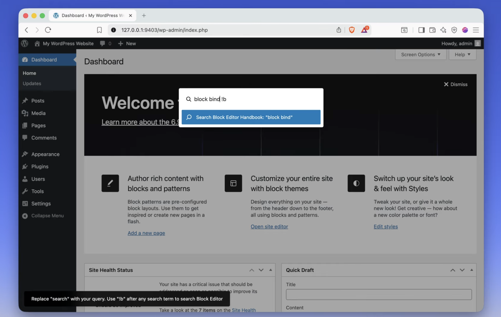

# Search Resources Commands

WordPress plugin for searching WordPress resources (handbooks, Learn WordPress, WordPress TV) via keyboard shortcuts and command palette (see [video](https://www.youtube.com/watch?v=a201wWyhObc) or [live demo](https://playground.wordpress.net/?blueprint-url=https://raw.githubusercontent.com/juanma-wp/search-resources-commands/refs/heads/main/_playground/blueprint.json)).

## Features

- **Command Palette Integration**: Type search terms followed by prefixes:
  - `!b` - Block Editor
  - `!t` - Theme
  - `!p` - Plugin
  - `!r` - REST API
  - `!l` - Learn WordPress
  - `!v` - WordPress TV

## Installation

1. Clone or download this repository to your WordPress plugins directory
2. Install dependencies: `npm install`
3. Build the plugin: `npm run build`
4. Activate the plugin in WordPress admin

## Development

- `npm start` - Start development mode with hot reload
- `npm run build` - Build for production

## Usage

### Method 1: Direct Search with Prefixes
1. Press `Cmd+K` to open command palette
2. Type your search term followed by a prefix (e.g., "blocks !b" for Block Editor, "gutenberg !l" for Learn WordPress)
3. Press Enter to search the selected resource

### Method 2: Using Search Commands (No Need to Remember Prefixes)
1. Press `Cmd+K` to open command palette
2. Type "handbook" or "search" to see available search commands for each resource (Block Editor, Theme, Plugin, REST API, Learn WordPress, WordPress TV)
3. Select the resource you want to search
4. The command palette will be pre-filled with your search term and the correct prefix automatically
5. Press Enter to search

## Requirements

- WordPress 6.0+
- Node.js 14+
- npm or yarn
